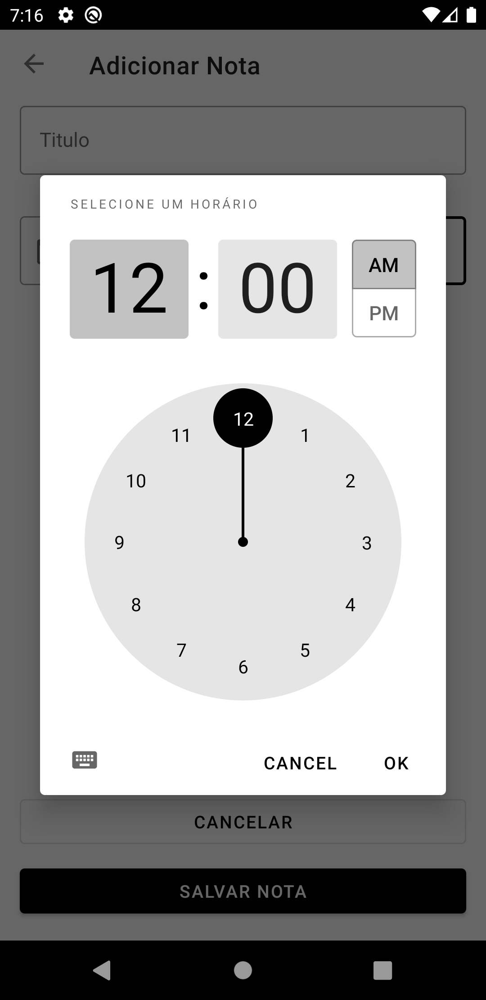

# santander-bootcamp-notes
## Resumo
Aplicativo de notas desenvolvido para o Bootcamp santander com a DIO.

## Sobre o Projeto
Aplicativo de notas que permite criar, editar e excluir notas. 
O projeto foi criado como um app de activity única, utilizando fragments e navigation.
Implementações futuras incluem a separação de notas por dia, a inclusão de testes e o uso de injeção de dependência.

## Stack de tecnologias
- Room
- Navigation com Safe Args
- MVVM
- View Binding
- Material Library

## Telas
<p float="left">
    
    
    
    
</p>

## Executar
```
# clonar repositório
URL repositório: https://github.com/rafaeldornelles/santander-bootcamp-notes.git

# abrir no android studio
Get from version control > colar url > clone
```
img[alt=drawing] { width: 200px; }